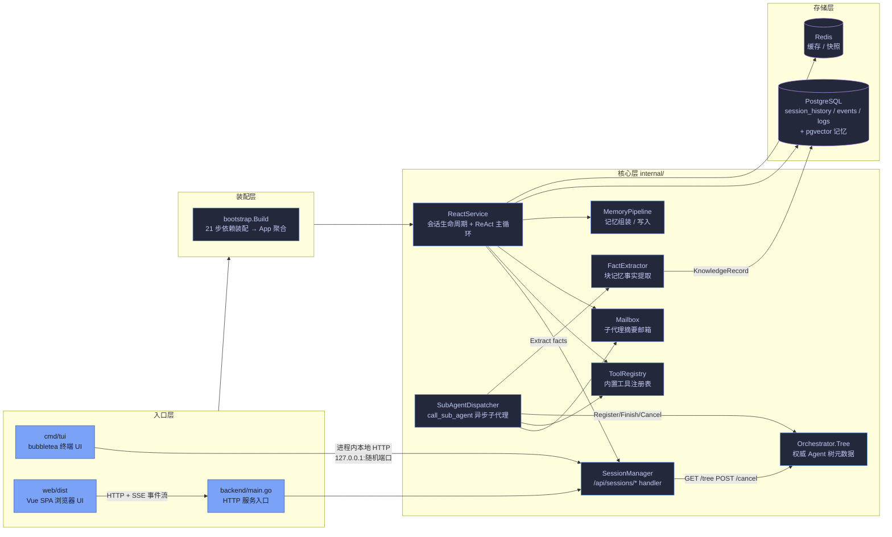
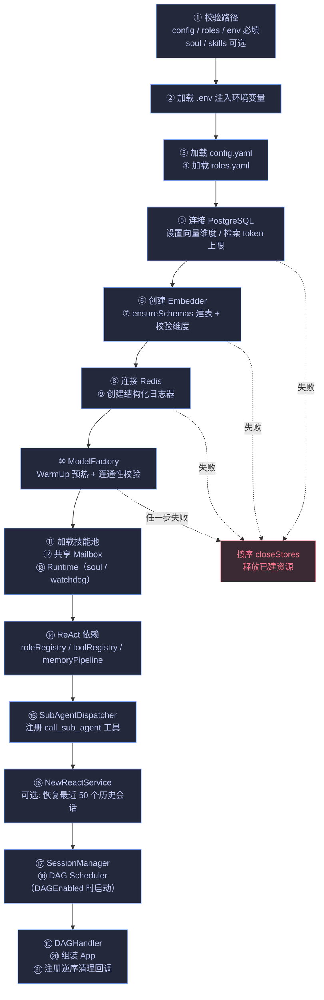
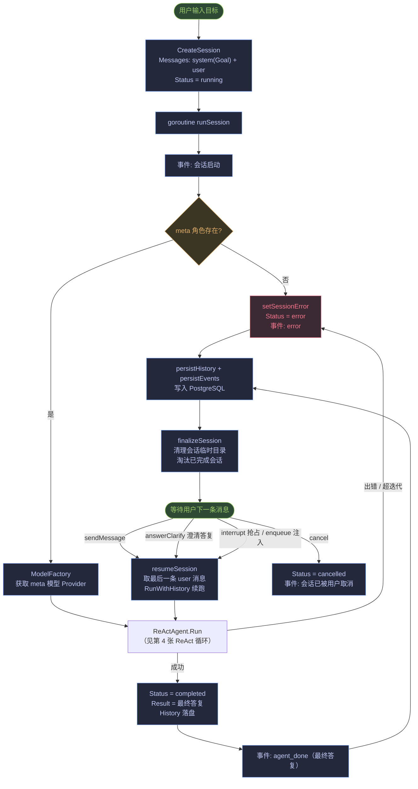
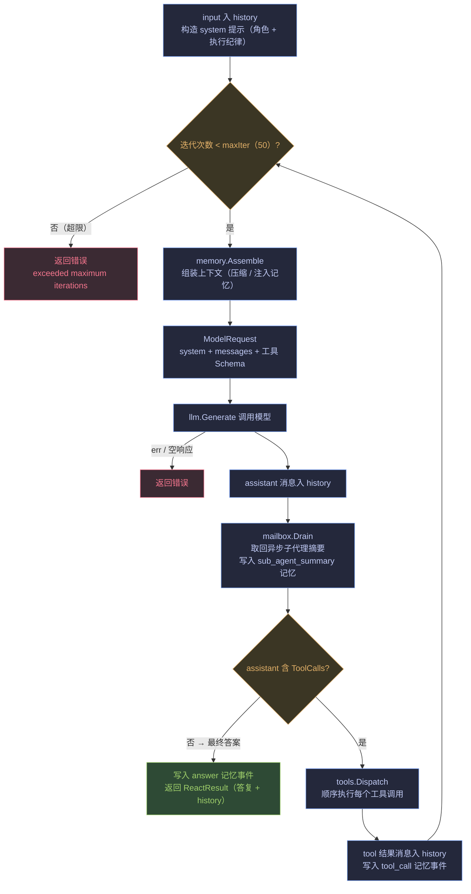
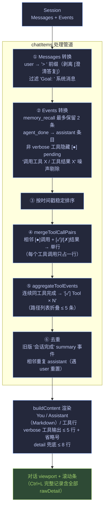

# BlockMemoryAgent 项目流程图

> 用途：逐步骤检查项目运行全貌。每张图覆盖一个阶段，末尾附**检查清单**（含代码锚点）。
> 渲染：VS Code / Typora / GitHub 可直接预览 Mermaid；或双击打开同目录 `流程图.html` 获得最佳视觉效果。
> 配色：与 TUI 一致（Tokyo Night）。

---

## 1. 系统总体架构



---

## 2. 启动装配流程（bootstrap.Build）

对应 `backend/internal/bootstrap/bootstrap.go:101`，HTTP 入口与 TUI 入口共用同一条装配路径。



---

## 3. 会话生命周期

对应 `backend/internal/agent/service_react.go`（`runSession:457` / `resumeSession:520` / `sendMessage:632`）。



---

## 4. ReAct 主循环（推理 → 行动 → 观察）

对应 `backend/internal/agent/react_agent.go:87`（`RunWithHistory`）。



---

## 5. 工具执行与事件流管线

对应 `backend/internal/domain/tool/registry.go:163/222` → `backend/internal/agent/service_react.go:416`（`handleToolEvent`）→ `session_react.go:286`（`addEvent`）。

```mermaid
flowchart LR
    DISP["ReActAgent<br/>tools.Dispatch"] --> REG["ToolRegistry.Execute"]
    REG --> E1["emitTool<br/>kind = tool_call<br/>Message = '调用工具 X'<br/>Detail = 参数 JSON"]
    REG --> EXEC["工具执行器<br/>ReadFile / WriteFile /<br/>RunCommand / ListDir /<br/>SearchInFiles / HTTPGet ..."]
    EXEC --> E2["emitResult<br/>kind = tool_result<br/>Detail = Result JSON<br/>（output / error / path / args_json）"]
    E1 --> HTE["ReactService.handleToolEvent"]
    E2 --> HTE
    HTE --> CHK{"会话存在<br/>且运行中?"}
    CHK -->|"否"| DROP["丢弃该事件"]
    CHK -->|"是"| PARSE["tool_call:<br/>toolArgsLabel 提取 path/command/url<br/>tool_result:<br/>解析 output / error / path"]
    PARSE --> AE["store.addEvent<br/>output 截断 4096 字符"]
    AE --> TRIM{"事件数 > 500?"}
    TRIM -->|"是"| CUT["从头裁剪到 200 条"]
    TRIM -->|"否"| MEM["session.Events 追加"]
    CUT --> MEM
    MEM --> STREAM["TUI Stream / Web SSE<br/>实时推送界面"]
    MEM --> LOG["结构化日志<br/>logs/tui|backend/*.log"]

    classDef step fill:#24283B,stroke:#7AA2F7,color:#C0CAF5
    classDef event fill:#2A2F45,stroke:#9ECE6A,color:#9ECE6A
    classDef decision fill:#3B3624,stroke:#E0AF68,color:#E0AF68
    classDef drop fill:#3B2A33,stroke:#F7768E,color:#F7768E
    class DISP,REG,EXEC,HTE,PARSE,AE,MEM,STREAM,LOG step
    class E1,E2 event
    class CHK,TRIM decision
    class DROP drop
```



---

## 6. TUI 对话区渲染管线（chatItems 六步）

对应 `backend/internal/tui/helpers.go`（`chatItems:243`）。**这是精简展示的核心管道，每一步都可单独检查。**



---

## 7. TUI 界面布局与数据来源

```
┌──────────────────────────────────────────────────────────────────────┐
│ 顶栏: BlockMemoryAgent v0.8.0 | Model | Memory | Session | Status     │
├──────────────────────────────────────────────┬───────────────────────┤
│                                              │ 📋 执行计划 (45%)      │
│  对话区（chatItems 六步管道）                  │  任务行 + 总体进度      │
│  · You      用户问题                          │  + 预计剩余            │
│  · Assistant 大模型输出（Markdown）           │  ← board.Snapshot     │
│  · [✓]/[✗] 工具行（合并/聚合后）              ├───────────────────────┤
│  · [●]     执行中工具                         │ 🧠 Agent 编排 (55%)    │
│                                              │  MetaAgent 卡片        │
│                                              │  └─ 子 Agent 卡片网格  │
│                                              │  ← agent.ListAgents   │
├──────────────────────────────────────────────┴───────────────────────┤
│ 输入栏: > Type your message...                                        │
│ 快捷键: [K] [P] [A] [L] [B] [M] [G] [S] [?] [Ctrl+C]                  │
└──────────────────────────────────────────────────────────────────────┘
```

---

## 8. 步骤检查清单

| # | 步骤 | 代码位置 | 检查点 |
|---|------|----------|--------|
| 1 | 配置加载 | `backend/cmd/tui/main.go:47` | 必需文件（config/roles/env/soul/skills）缺失即退出 |
| 2 | 文件日志 | `backend/cmd/tui/main.go:100` | TUI 静默 stderr，日志只写 `logs/tui/` |
| 3 | 依赖装配 | `backend/internal/bootstrap/bootstrap.go:101` | 21 步；任一步失败按序释放已建资源 |
| 4 | 本地 HTTP | `backend/cmd/tui/main.go:146` | 监听 `127.0.0.1:0` 随机端口，无需认证 |
| 5 | 会话创建 | `service_react.go:457` | goroutine 执行；meta 角色缺失 → error |
| 6 | ReAct 循环 | `react_agent.go:87` | maxIter=50；每轮 Assemble → Generate → ToolCalls? |
| 7 | mailbox 注入 | `react_agent.go:136` | 子代理摘要在每轮 assistant 后注入 |
| 8 | 工具事件产生 | `registry.go:163` / `registry.go:222` | tool_call 带参数 JSON；tool_result 带 Result JSON |
| 9 | 工具事件入库 | `service_react.go:416` | 会话非运行中丢弃；path/output/error 解析入库 |
| 10 | 事件内存上限 | `session_react.go:296/318` | output 截断 4096；事件 >500 裁到 200 |
| 11 | TUI 刷新触发 | `model.go:350` | tick 100ms；streamEvent 即时刷新 |
| 12 | chatItems 管道 | `helpers.go:243` | 本文第 6 张图的 ①~⑥ 逐步核对 |
| 13 | 工具行合并 | `helpers.go`（mergeToolCallPairs） | [●]+[✓] 相邻同工具 → 单行 |
| 14 | 工具行聚合 | `helpers.go:375`（aggregateToolEvents） | 仅无 detail 的连续同工具完成行 |
| 15 | assistant 去重 | `helpers.go`（chatItems 末尾） | 相邻重复删除；遇 user 消息重置 |
| 16 | 输出截断 | `helpers.go`（compactToolOutputLines=5） | 主对话区 ≤5 行；完整在 Ctrl+L |
| 17 | 计划面板 | `view.go`（renderPlanPanel） | 状态由 agent 树覆盖看板；预计剩余=已完成均值×剩余 |
| 18 | Agent 编排 | `agent_tree_panel.go`（renderAgentsPanel） | MetaAgent 置顶；宽度 ≥44 两列、≥72 三列 |

---

## 9. 关键裁剪 / 过滤点汇总（检查重点）

| 位置 | 规则 | 目的 |
|------|------|------|
| `chatItems` | `memory_recall` 最多内联 2 条 | 防召回刷屏 |
| `chatItems` | 非 verbose 工具隐藏 `[●]` pending 行 | 高频工具降噪 |
| `eventChatItem` | `调用工具 X / 工具结果 X` 固定文案剔除 | 去噪声 |
| `mergeToolCallPairs` | 调用/结果合并一行 | 每个工具调用一行 |
| `aggregateToolEvents` | 连续同工具 → `× N`，路径 ≤5 条 | 重复调用折叠 |
| `compactToolOutputLines` | verbose 输出 ≤5 行 | 中间结果折叠 |
| `displayDetailLines` | 工具 detail ≤8 行 | 兜底截断 |
| `addEvent` | output ≤4096 字符；事件 >500 裁 200 | 内存/DB 防爆 |
| 计划/编排面板 | 超高内容按行/卡片行裁剪 + "… 还有 N" 提示 | 布局不溢出 |
